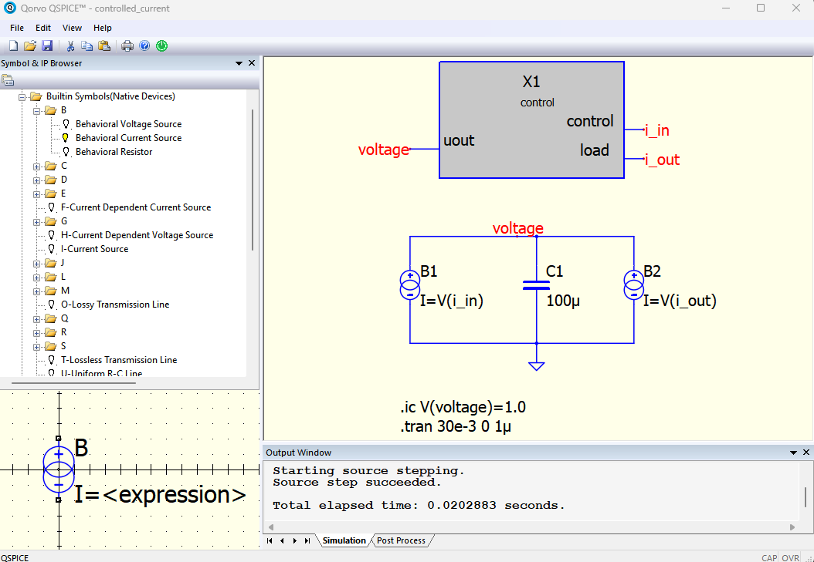
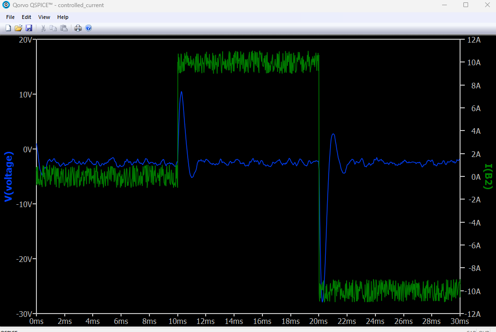

# QSPICE_rust_and_cmake_example

Test building Rust and C++ via CMake for QSPICE.

## Schematic and Simulation Response

Below are the schematic and simulation response figures for this project:

### Schematic


### Simulation Response


## Building the Project

The source can be build the directly from QSPICE, open `qspice/controlled_current.qsh`

To build with CMake:

```bash
> mkdir build
cd build
cmake -G "Ninja" -DCMAKE_C_COMPILER="d:\msys64\mingw32\bin\clang.exe" -DCMAKE_CXX_COMPILER="d:\msys64\mingw32\bin\clang++.exe" ..
cmake --build .
```

build with rust using
```bash
cargo build --release --target=i686-pc-windows-msvc
```

you can install rust from `rust-lang.org` and the 32 bit build tool using rustup with
```bash
rustup target add i686-pc-windows-msvc
```

CMake and clang compiler can be installed using msys with

```bash
pacman -S mingw-w64-x86_64-cmake
pacman -S mingw-w64-i686-clang
```
